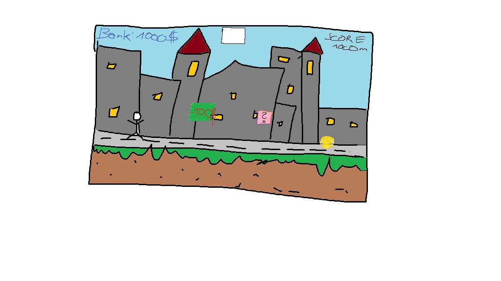
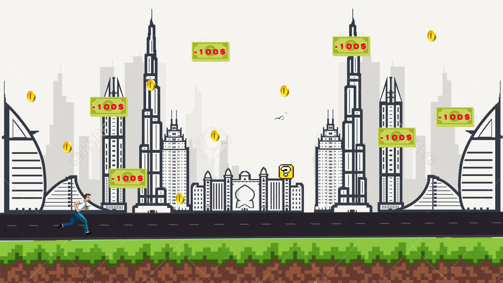
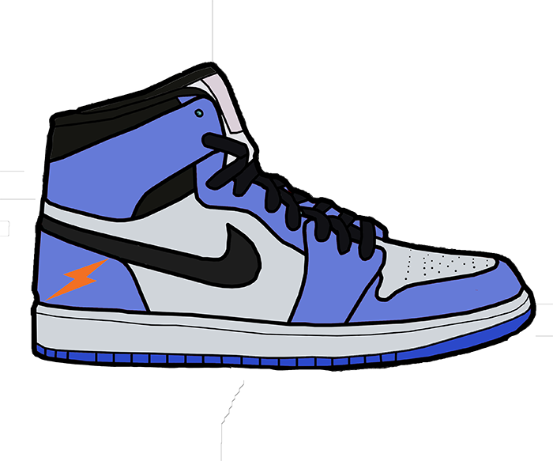
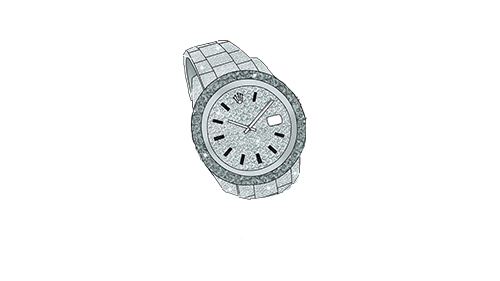
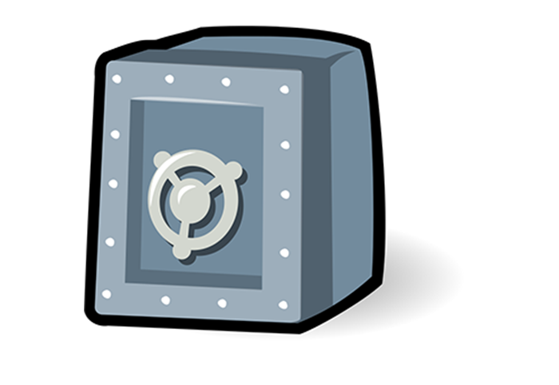
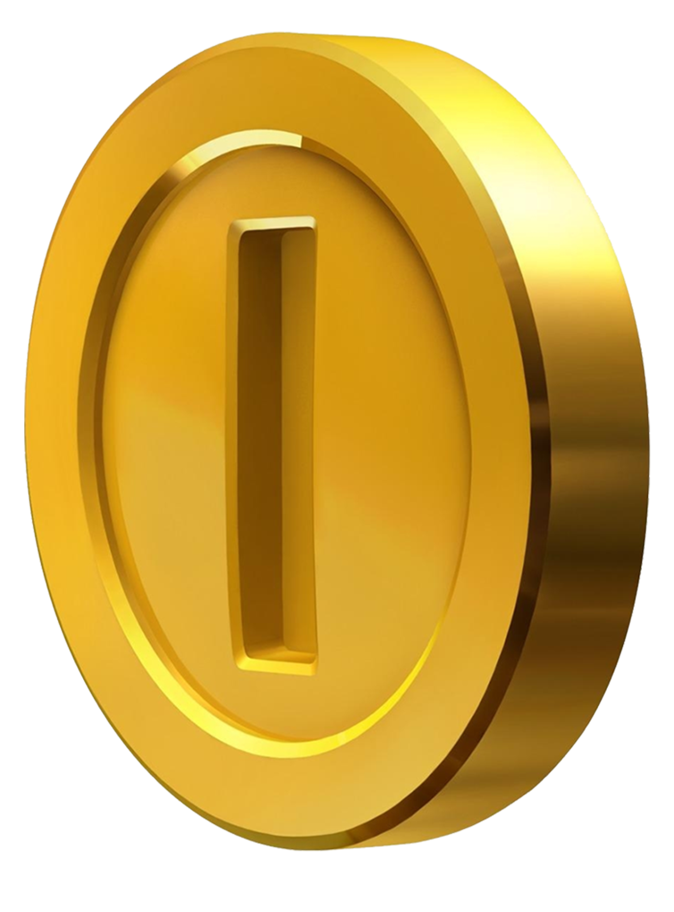
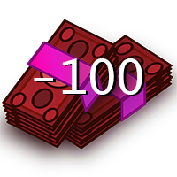
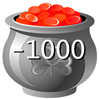

# DUBAI-RUNNER

## Description

##### Dubai Runners is a new and fun game. It represents a young man called *Mrinz Parcus von Zuhalt*. In this game it is all about collecting coins and avoiding bad items. You can also loose money if you hit bad items. But there are other items, good items. They can heal you and refill your life, so getting broke is not that easy.

***

## Our first sketch !

***

## Our second sketch !

***

| Language | IDEA |
| :-------------: |:----------------:|
| Java | IntelliJ |

## Items
| Items | abilities |
| :-------------: |:----------------:|
| Vaper fly 5% | 15% faster |
| La Ferrari | immortality |
| Rolex ice |  destroys harming blocks in your direct enviroment |
| Sunglasses | Reduces damage by 50% |
| Safe | 	 increases your  Bank maximum |
| More items are coming soon | So stay up to date |

***

##### The Player is running to the right and has to collect coins and avoid harming Items. The coins are spawning random in the sky and fall down. The bad items are coming from the left and right and you should not run to the left, because that lowers your score.

#### The main reason why we are developing the game is, that you can beat your own Highscores and battle against your friends.

***

#### Item: VaperFly 5%
#### Description: It gives you a speed boost

***

#### Item: Rolex Ice
#### Description: It deletes all Items on the screen

***

#### Item: Safe
#### Description: It increases your money you can store

***

#### Item: Coin
#### Description: It adds 50$ to your bank account

***

#### Enemy: Taxes
#### Description: It steals 100$ from your bank account

***

#### Enemy: Bigger Taxes
#### Description: It steals 1000$ from your bank account

***

| DATE | TIME | SUBJECT | PERIOD OF TIME |
| :-------------: | :----------------: | :-----------------------: | :-------------------: |
| 28.04.2020 | 15:50 - 17:30 | Planing and finding theme | 1h 40min |
| 29.04.2020 | 13:50 - 15:30 | Graphic design, background and running | 1h 40min |
| 29.04.2020 | 18:00 - 21:30 | running animation anf fixing background animation | 3h 30min |
| 30.04.2020 | 20:00 - 00:00 | jumping animation| 4h |
| 01.05.2020 | 9:00 -  13:40 | Fixing jumping animation and creating slide animation|4h 40min |
| 01.05.2020 | 20:00 - 00:00 | slide fixing and optimize code and adding enemies | 4h |
| 02.05.2020 | 10:15 - 12:45 | fixing enemies and adding coins | 2h 30min |
| 02.05.2020 | 13:15 - 14:00 | enemy hitboxes | 45min |
| 09.06.2020 | 15:30 - 17:50 | fixing big bug and making new clean Github Repo | 100min |
| 10.06.2020 | 9:20 - 10:30 | optimize Proposel | 1h 10min |

## TO-DO-List
* Start-Screen x
* End-Screen x
* Item-Functions
* Music
* Sound-Effects
* UML
* Jvadoc
* Better Proposel
* Presentation
* Eine Maximal Anzahl an Geld die man halten kann
